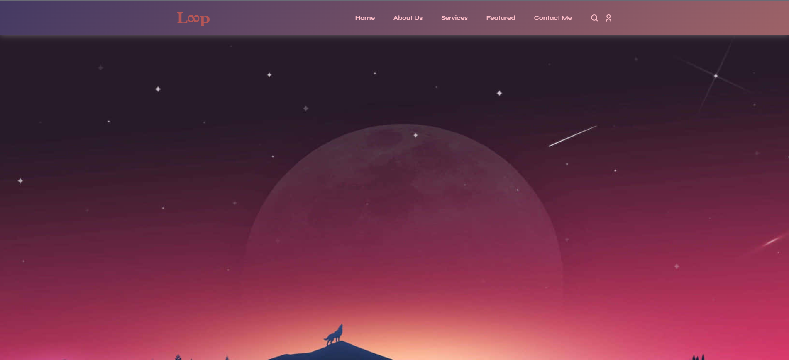
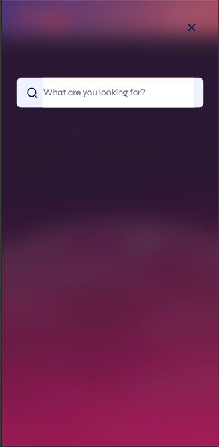

# 📱 Mobile-Friendly Website with Responsive Design

This is a fully responsive front-end project built using **HTML**, **CSS**, and **JavaScript**. It features a modern navigation bar, search and login modals, and a stylish footer with social icons and useful links.







----

## 🚀 Features

- ✅ Responsive navigation bar with logo and links

- 🔍 Modal search overlay with input and close button
- 🔐 Login modal with email/password and Google login option
- 🌙 Dark-styled footer with social icons and legal links
- 🎨 Smooth animations and modern UI styling

---

## 🛠️ Technologies Used

- HTML5

- CSS3 (with custom styling)
- JavaScript (for modal functionality)
- Google Fonts
- Remix Icons
- Font Awesome

---

## 📁 Folder Structure

```
📁 Day-4---Task4
├── index.html
├── style.css
└── script.js
```
---

---

## 📦 How to Use

1. **Clone the repository**
   ```bash
   git clone https://github.com/RishabhMunakhiya/Day-4---Task4.git
   cd Day-4---Task4
   ```
2. **Open index.html in your browser**

    You can open directly or use VS Code Live Server.


3. **Edit and customize**

    Modify style.css and script.js as needed.

---

### 🎉 Acknowledgements

- This project started from a wish to make something that looks good and works well.

- The clean and simple designs used here were inspired by real websites and apps.

- A big thanks to the awesome creators on YouTube and GitHub — their tutorials and code examples really helped me learn and build this.


---
### 🙌 Author
Made with ❤️ and dedication by [Rishabh](https://github.com/RishabhMunakhiya)
 